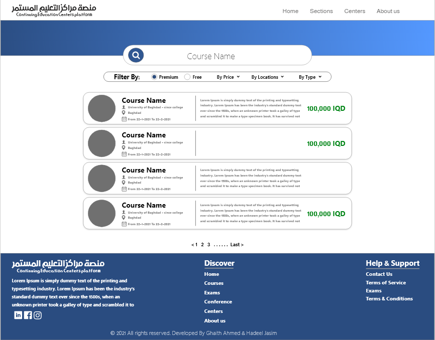

<h1 align="center" style="color:red;">Continuing Education Centers Platform</h1>

>#### Description

The project is a website for an electronic platform calls (Continuing education centers platform) that displays all courses offered by Continuing education centers in governmental universities in Iraq in addition to advertising for events, exams, camps and conferences.

>#### Database

Database contains posts, institutions and results (results of exams) tables. Institutions table relates with posts table via foreign key and results table uses foreign keys to relate to a post and institution.

>#### Programming Technologies
>>- **Flask**
>>- **Python**
>>- **Sqlite3**
>>- **Html**
>>- **Css**
>>- **Javascript**
>>- **Libraries such as bootstrap**
>>- **CS50 IDE**
>>- **Vs Code**

>#### How the Website Works

It's so easy to use the website. The customer can show proposed courses, events, conferences or exams and can search for any one of them or search in advance based on location for example.

>#### Possible Improvements

1- Giving each institution an administrator account for managing their posts.
2- Add an exam application to do exam online using the website.
3- Add the feature of the possibility of electronic reservation on courses and exams.

>#### How to Open Website

To run the website you need to use these commands:
#####`$ export API_KEY=value`
#####`$ flask run`

>#### Pages of Website
>>
______
>> **Home page**
>>>
>>>
>>>
______
>> **Courses & Examd & Confernce Pages**
>>>
>>>
>>>
_______
>> **About us page**
>>>
______
>> **Search page**
>>>
______
>> **Post page**
>>>

